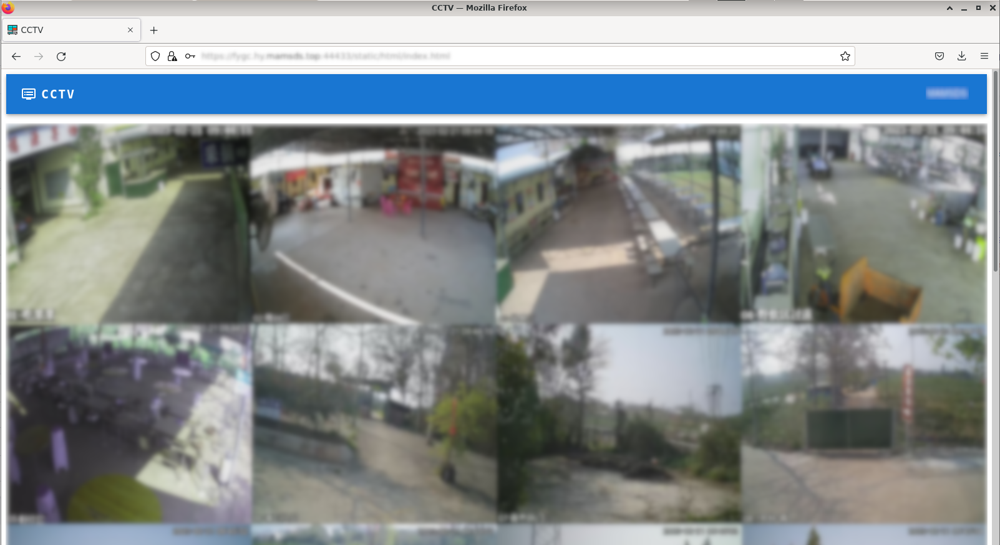
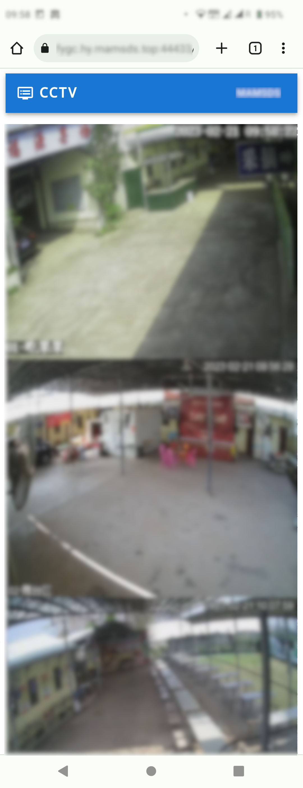

# CCTV Dashboard

- A web dashboard used to preview live images from CCTV cameras. It is designed
  to use [cuda-motion](https://github.com/alex-lt-kong/cuda-motion) as its
  backend and communicate with it using POSIX shared memory.

## Gallery

        
    

## Dependencies

- [Crow HTTP library](https://github.com/CrowCpp/Crow)
- `nlohmann-json` for JSON support: `apt install nlohmann-json3-dev`
- `cURL` for HTTP support: `apt install libcurl4-gnutls-dev`
- `protobuf`

## Build

- Back-end:
  - `mkdir ./build && ./build`
  - `cmake ../`
  - `make -j2`
- Front-end:
  - `npm install`
  - `node babelify.js [--dev|--prod]`
