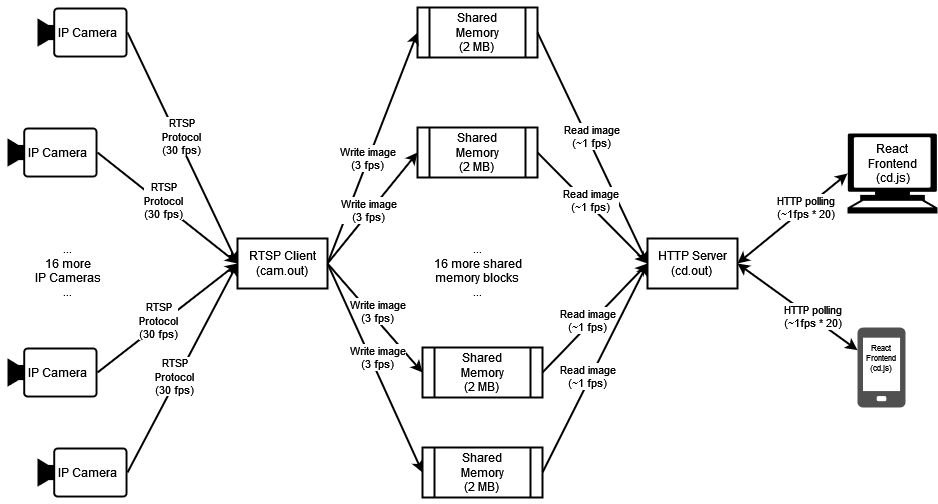

# On-demand CCTV server

* Twenty IP cameras are set and constantly streaming via the RTSP protocol.
* `cam.out`: a multi-thread RTSP client, reading images from IP cameras, throttling the frame rate down then writting
images to shared memory
* `odcs.out`: an HTTP server and shared memory reader, serving images to clients on demand.
* `odcs.js`: the ReactJs frontend showing images to end-user

## Dependencies
* Library search support: `apt install pkg-config`.
* [Crow HTTP library](https://github.com/CrowCpp/Crow)
* `nlohmann-json` for JSON support: `apt install nlohmann-json3-dev`
* [FFmpeg](https://trac.ffmpeg.org/wiki/CompilationGuide), as OpenCV's video I/O backend:
  * `apt-get uninstall ffmpeg`: default ffmpeg installation, if any, will probably not work.
  * `git clone https://github.com/FFmpeg/FFmpeg.git`: this is rarely a one-off thing, cloning the entire repository
    is almost always needed as we need to try a LOT of different versions.
  * Finding a compatible FFmpeg version to work with OpenCV is not easy. A lot of tests are conducted and their results
  are documented [here](./assets/ffmpeg-opencv-tests.csv)
  * `git checkout n2.8.1`: a lot of trial-and-error is done to avoid random crash and persisent memory leak when an
  existing RTSP connection is down and a new one is opened. Check
  [ffmpeg-opencv-tests.csv](./assets/ffmpeg-opencv-tests.csv) for details 
  * `./configure`, `make -j4`, `make install`
  * To test if an FFmpeg installation works with RTSP, try `ffmpeg -i "<RTSP URL>" -vcodec copy -r 20 -y /tmp/test.mp4`
  * If need to test more versions:
    * `make uninstall`: to remove previous `make install`'ed files.
    * `make distclean` and `make clean`: to remove cached `./configure`ed and `make`ed files.
    * `git clean -fd`: to remove anything not belong to the repo.
    * `git checkout <version>`.
* [OpenCV](https://docs.opencv.org/4.6.0/d7/d9f/tutorial_linux_install.html) for video frame manipulation:
    * `apt-get install libopencv-dev`: does not seem to work--it suffers from a sneaky memory-leaking bug...
    * `git clone https://github.com/opencv/opencv.git`.
    * `git checkout 2.4.13.7`: compiled dozens of versions before settling down to this...
    * `mkdir build && cd build`
    * `cmake -D WITH_GSTREAMER=OFF ../`
      * As we want to use `FFmpeg`, rather than `gstreamer`, as Video IO backend, explicitly disabling
      `gstreamer` may reduce confusion.
      * For more variants, refer to [this doc](./assets/ffmpeg-opencv-tests.csv)
    * `make -j4`, `make install`.

`libavcodec-dev libavdevice-dev libavfilter-dev libavformat-dev`
`rm /usr/local/lib/x86_64-linux-gnu/libav*` may not be able to be `make uninstall`ed

## Build

* Back-end: just `make` it
* Front-end: `node babelify.js [--dev|--prod]`