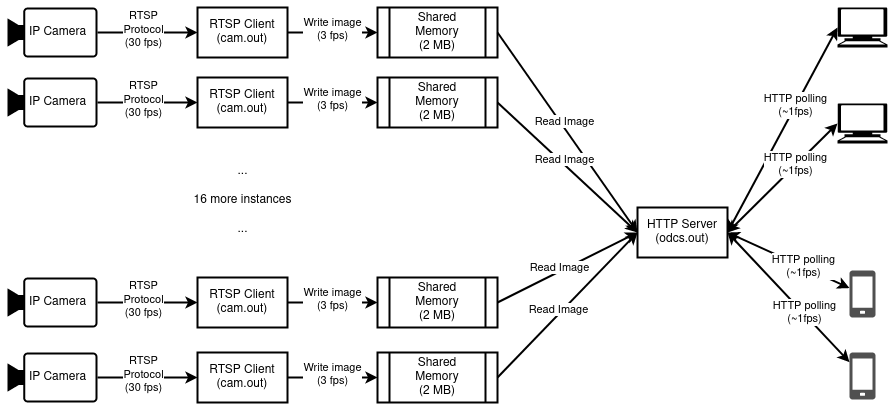

# On-demand CCTV server

The project is used in the following scenario:

* Twenty IP cameras are set and are constantly streaming via the RTSP protocol.
* Users need to watch real-time live streaming on an infrequent basis
(no more than a few times a day and no more than a few minutes each session).
* Users usually use average cellular mobile internet connection with usage billing
(i.e., they don't want to be charged a lot due to this service).
* Users are impatient, they don't want to wait for too long (5+ sec) to load all the live images.
* Users don't care FPS too much--0.5 frame per second is considered more than enough.

## Dependencies
* Library search support: `apt install pkg-config`.
* SSL/TLS support: `apt install gnutls-dev libgcrypt-dev`
* [Onion HTTP library](https://github.com/davidmoreno/onion)
    * Onion will be `make install`ed to `/usr/local/lib/`, add the directory to `$LD_LIBRARY_PATH`:
 `export LD_LIBRARY_PATH=$LD_LIBRARY_PATH:/usr/local/lib/`
* JSON support: `apt install libjson-c-dev`.
* OpenCV video I/O backend, [FFmpeg](https://trac.ffmpeg.org/wiki/CompilationGuide):
  * `apt-get uninstall ffmpeg`: default ffmpeg installation, if any, will probably not work.
  * `git clone https://github.com/FFmpeg/FFmpeg.git`: this is rarely a one-off thing, cloning the entire repository
    is almost always needed as we need to try a LOT of different versions.
  * Finding a compatible FFmpeg version to work with OpenCV is not easy. A lot of tests are conducted and their results
  are documented [here](./assets/ffmpeg-opencv-tests.csv)
  * `git checkout n1.2.12`: compiled dozens of newer versions, appears that all of them suffer from the same
    seanky memory leak bug when an existing RTSP connection is down and a new one is opened. This version
    appears to be bug-free.
  * `./configure`, `make -j4`, `make install`
  * To test if an FFmpeg installation works with RTSP, try `ffmpeg -i "<RTSP URL>" -vcodec copy -r 20 -y /tmp/test.mp4`
  * If need to test more versions:
    * `make uninstall`: to remove previous `make install`'ed files.
    * `make distclean` and `make clean`: to remove cached `./configure`ed and `make`ed files.
    * `git clean -fd`: to remove anything not belong to the repo.
    * `git checkout <version>`.
* Frame manipulation, [OpenCV](https://docs.opencv.org/4.6.0/d7/d9f/tutorial_linux_install.html):
    * `apt-get install libopencv-dev`: does not seem to work--it suffers from a sneaky memory-leaking bug...
    * `git clone https://github.com/opencv/opencv.git`.
    * `git checkout 2.4.13.7`: compiled dozens of versions before settling down to this...
    * `mkdir build && cd build`
    * `cmake -D WITH_GSTREAMER=OFF ../`
      * As we want to use `FFmpeg`, rather than `gstreamer`, as Video IO backend, explicitly disabling
      `gstreamer` may reduce confusion.
      * For more variants, refer to [this doc](./assets/ffmpeg-opencv-tests.csv)
    * `make -j4`, `make install`.

`libavcodec-dev libavdevice-dev libavfilter-dev libavformat-dev`
`rm /usr/local/lib/x86_64-linux-gnu/libav*` may not be able to be `make uninstall`ed